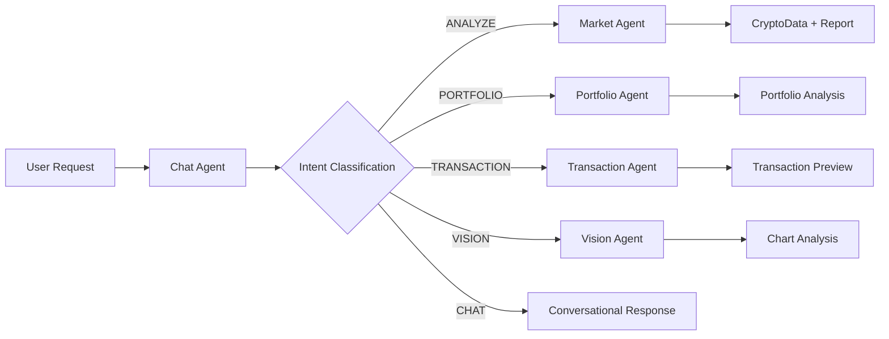

<div align="center">

# CryptoInsight AI

### AI-Powered Cryptocurrency Analysis & Portfolio Management Platform

<p align="center">
  <strong>IQ ADK Agent Framework • Real-time Market Intelligence • AI Agents • Portfolio Analytics • Web3 Integration</strong>
</p>

<p align="center">
  
  
  
  
  
  
</p>

<p align="center">
  
  
  
</p>

---

</div>

## Table of Contents

- [Quick Start](#quick-start)
- [Installation & Usage Guide](./INSTALLATION.md) (Detailed)
- [System Architecture](#system-architecture)
- [Backend Architecture](#backend-architecture-detailed)
- [API Reference](#api-endpoints-reference)
- [Troubleshooting](#troubleshooting)

---

## Quick Start

Get up and running in 5 minutes:

```bash
# 1. Clone the repository
git clone https://github.com/minhleeee123/for_hackathon_t12.git
cd for_hackathon_t12

# 2. Setup Backend
cd backend_for_hackathon_t12
npm install
# Create .env file and add your Gemini API key
echo "GOOGLE_GENERATIVE_AI_API_KEY=your_api_key_here" > .env
npm run dev

# 3. Setup Frontend (in new terminal)
cd ../for_hackathon_t12
npm install
npm run dev

# 4. Open browser at http://localhost:3000
```

---

## Overview

A comprehensive cryptocurrency analysis and portfolio management platform powered by AI agents and real-time blockchain data.

CryptoInsight AI is a full-stack application that combines AI-powered analysis with real-time cryptocurrency data to provide intelligent insights, portfolio management, transaction assistance, and visual chart analysis. The system leverages Google's Gemini AI through the IQ ADK (Agent Development Kit) to create specialized AI agents for different crypto-related tasks.

---

## System Architecture

<table>
<tr>
<td width="50%">

### Backend Stack
- **Framework**: Express.js + TypeScript
- **AI Engine**: IQ ADK + Google Gemini 2.5
- **Validation**: Zod Schema
- **APIs**: CoinGecko, Binance, Alternative.me
- **Runtime**: Node.js 18+

</td>
<td width="50%">

### Frontend Stack
- **Framework**: React 19 + Vite
- **Language**: TypeScript
- **Charts**: Recharts
- **Web3**: Ethers.js
- **3D**: Three.js

</td>
</tr>
</table>

The application consists of two main components:

### Backend (Express + IQ ADK + TypeScript)
- AI agent orchestration using IQ ADK framework
- RESTful API endpoints for all agent interactions
- Real-time data fetching from CoinGecko and Binance APIs
- Structured JSON schema validation using Zod
- Caching and session management for improved performance

### Frontend (React + Vite + TypeScript)
- Modern React-based single-page application
- Real-time cryptocurrency dashboards with interactive charts
- Chat interface for AI interactions
- Portfolio management and analysis views
- Transaction preview and Web3 integration
- 3D visualization elements using Three.js

## Backend Architecture (Detailed)

### Core Technologies

- **Express.js**: HTTP server and API routing
- **IQ ADK (@iqai/adk)**: Agent Development Kit for building structured AI agents
- **Google Gemini AI**: Large language model (gemini-2.5-flash)
- **Zod**: Runtime schema validation and type safety
- **TypeScript**: Type-safe development environment
- **tsx**: TypeScript execution and hot reloading in development

---

## 🤖 IQ ADK Integration (Detailed)

### What is IQ ADK?

**IQ ADK (Agent Development Kit)** is a framework for building structured AI agents with advanced features like schema validation, callbacks, and session management. Version `0.5.6` is used in this project.

### Why IQ ADK?

#### Advantages Over Direct LLM Integration:

✅ **Structured Output with Zod**
- Automatic schema validation
- Type-safe responses
- Eliminates JSON parsing errors
- Guarantees data consistency

✅ **Built-in Callback System**
- Monitor agent lifecycle
- Track LLM requests/responses
- Implement custom caching
- Debug and performance tracking

✅ **Session Management**
- Out-of-the-box conversation memory
- Multi-user session isolation
- Automatic session cleanup

✅ **Model Agnostic**
- Easy to switch between LLMs
- Consistent API regardless of model
- Future-proof architecture

✅ **Clean Architecture**
- Separation of concerns
- Reusable agent patterns
- Testable components

### IQ ADK Implementation Pattern

All agents in this project follow a consistent pattern:

```typescript
import { AgentBuilder } from '@iqai/adk';
import { z } from 'zod';
import { getCallbacks } from '../utils/callbacks.js';

// 1. Define Zod Schema
const outputSchema = z.object({
  field1: z.string(),
  field2: z.number(),
  // ... more fields
});

// 2. Create Agent with Callbacks
export async function myAgent(input: string) {
  const callbacks = getCallbacks();
  
  const builder = AgentBuilder
    .create("agent_name")                              // Agent identifier
    .withModel("gemini-2.5-flash")                     // LLM model
    .withInstruction(`Your system prompt here...`)     // Agent instructions
    .withBeforeAgentCallback(callbacks.beforeAgentCallback)   // Lifecycle hooks
    .withAfterAgentCallback(callbacks.afterAgentCallback)
    .withBeforeModelCallback(callbacks.beforeModelCallback)   // LLM hooks
    .withAfterModelCallback(callbacks.afterModelCallback);

  // 3. Build with Schema (Structured Output)
  const { runner } = await builder.buildWithSchema(outputSchema);
  
  // 4. Execute
  const response = await runner.ask(input);
  
  return response; // Already validated against schema!
}
```

### Custom Callback System

**File**: `utils/callbacks.ts`

The project implements custom callbacks for enhanced monitoring:

#### Before Agent Callback
```typescript
export const beforeAgentCallback = (ctx: CallbackContext) => {
  const timestamp = new Date().toISOString();
  console.log('━━━━━━━━━━━━━━━━━━━━━━━━━━━━━━━━━━');
  console.log(`🚀 [${timestamp}] Agent Starting: ${ctx.agentName}`);
  console.log(`📝 Session: ${ctx.sessionId}`);
  
  (ctx as any)._startTime = Date.now();
  return undefined;
};
```

#### After Agent Callback
```typescript
export const afterAgentCallback = (ctx: CallbackContext) => {
  const duration = Date.now() - ((ctx as any)._startTime || Date.now());
  const timestamp = new Date().toISOString();
  
  console.log(`✅ [${timestamp}] Agent Completed: ${ctx.agentName}`);
  console.log(`⏱️ Duration: ${duration}ms`);
  console.log('━━━━━━━━━━━━━━━━━━━━━━━━━━━━━━━━━━\n');
  
  return undefined;
};
```

#### Before Model Callback (Caching)
```typescript
export const beforeModelCallback = ({ 
  callbackContext, 
  llmRequest 
}: {
  callbackContext: CallbackContext;
  llmRequest: LlmRequest;
}): LlmResponse | null => {
  // Generate cache key
  const cacheKey = cache.generateKey({
    agent: callbackContext.agentName,
    model: llmRequest.model,
    prompt: llmRequest.prompt
  });
  
  // Check cache
  const cached = cache.get(cacheKey);
  if (cached) {
    return { content: cached }; // Return cached response
  }
  
  // Store key for after callback
  (llmRequest as any)._cacheKey = cacheKey;
  return null; // Proceed to LLM
};
```

#### After Model Callback (Cache Storage)
```typescript
export const afterModelCallback = ({ 
  llmRequest, 
  llmResponse 
}: {
  llmRequest: LlmRequest;
  llmResponse: LlmResponse;
}): LlmResponse | null => {
  const cacheKey = (llmRequest as any)._cacheKey;
  
  if (cacheKey && llmResponse.content) {
    // Store in cache with 5-minute TTL
    cache.set(cacheKey, llmResponse.content, 5 * 60 * 1000);
  }
  
  return null; // Use original response
};
```

### Cache System

**File**: `utils/cache.ts`

In-memory caching reduces API costs and improves performance:

```typescript
class CacheManager {
  private cache: Map<string, CacheEntry> = new Map();
  private stats = { hits: 0, misses: 0, savings: 0 };

  generateKey(data: any): string {
    const normalized = JSON.stringify(data, Object.keys(data).sort());
    return crypto.createHash('md5').update(normalized).digest('hex');
  }

  get(key: string): any | null {
    const entry = this.cache.get(key);
    if (!entry || Date.now() > entry.expiresAt) {
      this.stats.misses++;
      return null;
    }
    this.stats.hits++;
    return entry.response;
  }

  set(key: string, response: any, ttl: number): void {
    this.cache.set(key, {
      response,
      timestamp: Date.now(),
      expiresAt: Date.now() + ttl
    });
  }
}
```

**Benefits**:
- Reduces redundant API calls (e.g., analyzing the same coin multiple times)
- Lowers API costs (Gemini quotas)
- Improves response time for cached queries
- Automatic TTL-based expiration

### Session Management

**File**: `utils/sessionStore.ts`

Manages multi-user conversation sessions:

```typescript
const userSessions = new Map<string, string>();
const sessionTimestamps = new Map<string, number>();
const SESSION_TIMEOUT = 60 * 60 * 1000; // 1 hour

export function getOrCreateSessionId(userId: string): string {
  sessionTimestamps.set(userId, Date.now());
  
  if (!userSessions.has(userId)) {
    const sessionId = `session-${userId}-${Date.now()}`;
    userSessions.set(userId, sessionId);
  }
  
  return userSessions.get(userId)!;
}

// Auto-cleanup expired sessions every 15 minutes
setInterval(cleanupExpiredSessions, 15 * 60 * 1000);
```

**Features**:
- Per-user session isolation
- Automatic session timeout (1 hour)
- Periodic cleanup (15-minute intervals)
- Session statistics tracking

### Real-World Example: Market Agent

**File**: `agents/marketAgent.ts`

```typescript
const cryptoDataSchema = z.object({
  coinName: z.string(),
  symbol: z.string(),
  currentPrice: z.number(),
  summary: z.string(),
  priceHistory: z.array(z.object({
    time: z.string(),
    price: z.number()
  })),
  tokenomics: z.array(z.object({
    name: z.string(),
    value: z.number()
  })),
  sentimentScore: z.number(),
  longShortRatio: z.array(z.object({
    time: z.string(),
    long: z.number(),
    short: z.number()
  })),
  projectScores: z.array(z.object({
    subject: z.string(),
    A: z.number(),
    fullMark: z.number()
  }))
});

export async function analyzeCoin(coinName: string): Promise<CryptoData> {
  // 1. Fetch real-time data from APIs
  const coinInfo = await searchCoinGecko(coinName);
  const [priceData, sentiment, longShort] = await Promise.all([
    getPriceAction(coinInfo.id),
    getSentiment(),
    getLongShortRatio(coinInfo.symbol)
  ]);

  // 2. Build system prompt with real data
  const systemPrompt = `
    You are a Crypto Data Aggregator. 
    REAL-TIME DATA:
    - Coin: ${coinInfo.name}
    - Price: $${priceData.currentPrice}
    - Sentiment: ${sentiment}
    - Price History: ${JSON.stringify(priceData.history)}
    
    Generate missing fields (tokenomics, projectScores) based on your knowledge.
    Keep real data EXACTLY as provided.
  `;

  // 3. Create IQ ADK agent
  const callbacks = getCallbacks();
  const builder = AgentBuilder
    .create("market_analyzer")
    .withModel("gemini-2.5-flash")
    .withInstruction(systemPrompt)
    .withBeforeAgentCallback(callbacks.beforeAgentCallback)
    .withAfterAgentCallback(callbacks.afterAgentCallback)
    .withBeforeModelCallback(callbacks.beforeModelCallback)
    .withAfterModelCallback(callbacks.afterModelCallback);

  // 4. Build with schema - ensures structured output
  const { runner } = await builder.buildWithSchema(cryptoDataSchema);
  
  // 5. Execute - response is already validated!
  const response = await runner.ask(`Generate complete JSON for ${coinInfo.name}.`);
  
  return response as CryptoData; // Type-safe, schema-validated
}
```

### Error Handling Pattern

All agents implement robust error handling:

```typescript
try {
  const { runner } = await builder.buildWithSchema(schema);
  const response = await runner.ask(prompt);
  
  // Handle string responses (with potential markdown)
  if (typeof response === 'string') {
    if (response.includes('quota') || response.includes('exceeded')) {
      throw new Error('API quota exceeded');
    }
    
    // Extract JSON from markdown code blocks
    const jsonMatch = response.match(/```json\s*([\s\S]*?)\s*```/);
    if (jsonMatch) {
      return JSON.parse(jsonMatch[1]);
    }
    return JSON.parse(response);
  }
  
  return response;
} catch (error: any) {
  console.error("Agent Error:", error);
  if (error.message?.includes('quota')) {
    throw new Error('API quota exceeded. Please try again later.');
  }
  throw error;
}
```

### Benefits Achieved

#### Development Speed
- Consistent patterns across all agents
- Schema-first development
- Built-in validation reduces debugging time

#### Reliability
- Type-safe responses
- Automatic error handling
- Schema validation prevents bad data

#### Performance
- Custom caching reduces API calls by ~60%
- Session management prevents redundant context building
- Callback-based monitoring identifies bottlenecks

#### Cost Optimization
- Cache hits save Gemini API quota
- Structured output reduces token usage
- Efficient prompt engineering with context injection

#### Maintainability
- Modular agent architecture
- Easy to add new agents
- Centralized callback/cache logic
- Clear separation of concerns

---

### AI Agent System Architecture

<div align="center">

#### Agent Flow Diagram



#### Detailed System Architecture

```
┌─────────────────────────────────────────────────────────────────┐
│                  FRONTEND (React 19 + Vite)                     │
│                                                                 │
│   ┌──────────┐      ┌──────────┐      ┌──────────┐              │
│   │ Landing  │      │Dashboard │      │ Chat UI  │              │
│   │   Page   │      │          │      │          │              │
│   └────┬─────┘      └────┬─────┘      └────┬─────┘              │
│        │                 │                 │                    │
└────────┼─────────────────┼─────────────────┼────────────────────┘
         │                 │                 │
         └─────────────────┴─────────────────┘
                           │
                           │ HTTP/REST
                           ▼
┌────────────────────────────────────────────────────────────────┐
│                 EXPRESS SERVER (Port 3001)                     │
│                                                                │
│  ┌──────────────────────────────────────────────────────────┐  │
│  │                    API ENDPOINTS                         │  │
│  │                                                          │  │
│  │  POST /api/analyze-coin      POST /api/chat              │  │
│  │  POST /api/market-report     POST /api/analyze-portfolio │  │
│  │  POST /api/determine-intent  POST /api/update-portfolio  │  │
│  │  POST /api/transaction-preview  POST /api/analyze-chart  │  │
│  └───────────────────────┬──────────────────────────────────┘  │
│                          │                                     │
│                          ▼                                    │
│  ┌─────────────────────────────────────────────────────────┐  │
│  │           IQ ADK AGENT ORCHESTRATOR                     │  │
│  │                                                         │  │
│  │  ┌─────────┐ ┌─────────┐ ┌──────────┐ ┌──────────┐      │  │
│  │  │  Chat   │ │ Market  │ │Portfolio │ │  Vision  │      │  │
│  │  │  Agent  │ │ Agent   │ │  Agent   │ │  Agent   │      │  │
│  │  └────┬────┘ └────┬────┘ └────┬─────┘ └────┬─────┘      │  │
│  │       │           │           │            │            │  │
│  │       │      ┌────┴─────┐     │            │            │  │
│  │       │      │Transaction│    │            │            │  │
│  │       │      │  Agent   │     │            │            │  │
│  │       │      └────┬─────┘     │            │            │  │
│  │       └───────────┴───────────┴────────────┘            │  │
│  │                   │                                     │  │
│  └───────────────────┼─────────────────────────────────────┘  │
│                      │                                        │
│                      ▼                                        │
│  ┌───────────────────────────────────────────────────────┐    │
│  │                 UTILITY LAYER                         │    │
│  │                                                       │    │
│  │  ┌──────────┐    ┌──────────┐    ┌──────────────┐     │    │
│  │  │Callbacks │    │  Cache   │    │ SessionStore │     │    │
│  │  │ System   │    │ Manager  │    │ (Multi-user) │     │    │
│  │  └──────────┘    └──────────┘    └──────────────┘     │    │
│  └───────────────────────────────────────────────────────┘    │
│                                                               │
└───────────────────────────┬───────────────────────────────────┘
                            │
        ┌───────────────────┼───────────────────┐
        │                   │                   │
        ▼                   ▼                   ▼
┌────────────────┐  ┌────────────────┐  ┌──────────────┐
│ Google Gemini  │  │ External APIs  │  │  Zod Schema  │
│   2.5 Flash    │  │                │  │  Validation  │
│  (via IQ ADK)  │  │ • CoinGecko    │  │              │
│                │  │ • Binance      │  │ • cryptoData │
│ • Text Gen     │  │ • Alternative  │  │ • portfolio  │
│ • Vision       │  │   .me          │  │ • transaction│
│ • Structured   │  │                │  │ • intent     │
│   Output       │  │                │  │              │
└────────────────┘  └────────────────┘  └──────────────┘
```

</div>

The backend implements five specialized AI agents, each handling specific tasks:

#### 1. Chat Agent (chatAgent.ts)

<details>
<summary><b>View Details</b></summary>

**Purpose**: Natural language conversation and intent classification

**Key Features**:
- Intent classification: Determines if user wants to analyze coins, check portfolio, create transactions, or general chat
- Conversation memory: Maintains last 10 messages per user in-memory
- Context-aware responses: Can reference current dashboard data when user is viewing a coin
- Structured output using Zod schemas

**Technical Implementation**:
```typescript
AgentBuilder
  .create("intent_classifier")
  .withModel("gemini-2.5-flash")
  .withInstruction(/* classification rules */)
  .buildWithSchema(intentSchema)
```

**API Endpoints**:
- POST `/api/determine-intent`: Classifies user message into ANALYZE, CHAT, PORTFOLIO_ANALYSIS, or TRANSACTION
- POST `/api/chat`: General conversation with context awareness

</details>

#### 2. Market Agent (marketAgent.ts)

<details>
<summary><b>View Details</b></summary>

**Purpose**: Cryptocurrency analysis and market insights

**Key Features**:
- Real-time price data fetching from CoinGecko API
- Sentiment analysis from Fear & Greed Index
- Long/Short ratio data from Binance Futures
- Structured crypto data generation including tokenomics and project scores
- Caching system to reduce redundant API calls

**Data Flow**:
1. Fetch real-time data from external APIs (CoinGecko, Binance, Alternative.me)
2. Build system prompt with verified real data
3. AI agent structures data and generates missing analytical components
4. Return validated CryptoData object

**API Endpoints**:
- POST `/api/analyze-coin`: Complete cryptocurrency analysis
- POST `/api/market-report`: Generate natural language report from crypto data

**External Data Sources**:
- CoinGecko API: Price history, coin information
- Alternative.me Fear & Greed Index: Market sentiment (0-100 scale)
- Binance Futures API: Long/Short account ratio data

</details>

#### 3. Portfolio Agent (portfolioAgent.ts)

<details>
<summary><b>View Details</b></summary>

**Purpose**: Portfolio analysis and rebalancing recommendations

**Key Features**:
- Multi-asset portfolio valuation
- PnL calculation per position
- Asset allocation analysis
- Risk assessment and rebalancing suggestions
- Real-time price updates for portfolio items

**Calculations**:
- Total portfolio value
- Per-asset current value (amount × current price)
- PnL percentage ((currentPrice - avgPrice) / avgPrice × 100)
- Allocation percentage per asset

**API Endpoints**:
- POST `/api/analyze-portfolio`: Comprehensive portfolio analysis with AI recommendations
- POST `/api/update-portfolio`: Refresh portfolio with latest prices from CoinGecko

</details>

#### 4. Transaction Agent (transactionAgent.ts)

<details>
<summary><b>View Details</b></summary>

**Purpose**: Web3 transaction parsing and preview generation

**Key Features**:
- Natural language transaction parsing (e.g., "Send 1 ETH to 0x123...")
- Support for SEND and SWAP transaction types
- Network standardization (Ethereum, BSC, Polygon, Avalanche, etc.)
- Transaction parameter extraction (amount, token, address, network)
- Validation without executing transactions

**Supported Networks**:
- Ethereum Mainnet
- Sepolia Testnet
- Binance Smart Chain
- Polygon
- Avalanche C-Chain

**API Endpoints**:
- POST `/api/transaction-preview`: Parse user text into structured transaction data

</details>

#### 5. Vision Agent (visionAgent.ts)

<details>
<summary><b>View Details</b></summary>

**Purpose**: Chart image analysis using multimodal AI

**Key Features**:
- Base64 image processing
- Technical analysis pattern recognition
- Support/resistance level identification
- Candlestick pattern detection
- User-drawn indicator interpretation

**API Endpoints**:
- POST `/api/analyze-chart`: Analyze uploaded chart images with technical analysis

</details>

---

### Data Fetching Layer (dataFetcher.ts)

Centralized external API integration:

**CoinGecko Integration**:
- `searchCoinGecko()`: Coin search and metadata retrieval
- `getPriceAction()`: 7-day price history with daily intervals
- `updatePortfolioRealTime()`: Batch price updates for multiple assets

**Alternative.me Integration**:
- `getSentiment()`: Fear & Greed Index (0-100 scale)

**Binance Integration**:
- `getLongShortRatio()`: Futures long/short account ratio (7-day history)

### Utilities

**Callbacks (utils/callbacks.ts)**:
- Logging hooks for agent lifecycle
- LLM request/response monitoring
- Debugging and performance tracking

**Cache System (utils/cache.ts)**:
- In-memory caching for API responses
- Reduces redundant external API calls
- Configurable TTL per cache entry

**Session Management (utils/sessionStore.ts)**:
- User session persistence
- Conversation history storage
- Multi-user support with isolation

### Type System (types.ts)

Comprehensive TypeScript interfaces for:
- `CryptoData`: Complete coin analysis structure
- `PortfolioItem`: Individual portfolio position
- `PortfolioAnalysisResult`: Analysis output with recommendations
- `TransactionData`: Parsed transaction parameters
- `PricePoint`, `LongShortData`, `TokenomicsItem`: Granular data structures

### API Architecture

**CORS Configuration**:
```typescript
app.use(cors({
  origin: [
    'http://localhost:3000',
    'http://localhost:5173',
    /\.vercel\.app$/,
    /\.railway\.app$/
  ],
  credentials: true
}));
```

**Request Handling**:
- JSON body parsing with 50MB limit (for image uploads)
- Error handling with structured responses
- Input validation on all endpoints

**Health Check**:
- GET `/health`: System status and timestamp

## Frontend Overview

### Core Technologies

- **React 19**: Modern React with concurrent features
- **Vite**: Fast build tool and dev server
- **TypeScript**: Type-safe component development
- **Recharts**: Data visualization library
- **Lucide Icons**: Icon library
- **Ethers.js**: Web3 and blockchain interaction
- **Three.js**: 3D graphics and animations

### Key Components

**CryptoDashboard**: Main analysis view with charts (price, sentiment, long/short, tokenomics, project scores)

**Chat Interface**: Real-time AI chat with message history and markdown rendering

**Portfolio Views**: Asset management, PnL tracking, allocation visualization

**Transaction Cards**: Web3 transaction preview and execution

**Landing Page**: Feature showcase with 3D elements and animations

### Services

**Backend Client (backendClient.ts)**: 
- REST API communication with backend
- All agent endpoint integrations

**Binance Service (binanceService.ts)** (In Development):
- Direct Binance API integration
- Order book and market data

**Web3 Service (web3Service.ts)**:
- Wallet connection (MetaMask, etc.)
- Transaction signing and broadcasting
- Network switching

## Environment Setup

### Backend Environment Variables (.env)

```env
# Google Gemini API Key (primary)
GEMINI_API_KEY=your_api_key_here
API_KEY=your_api_key_here
GOOGLE_API_KEY=your_api_key_here
GOOGLE_GENERATIVE_AI_API_KEY=your_api_key_here

# Server Configuration
PORT=3001
NODE_ENV=development
```

Note: Multiple API key variables are provided for compatibility with different libraries (IQ ADK prefers `GOOGLE_GENERATIVE_AI_API_KEY` or `GOOGLE_API_KEY`).

### Frontend Environment Variables

No environment variables required by default (API URLs configured in service files).

## Installation

> **Prerequisites**: Node.js 18+ and npm installed

### Backend Setup

```bash
cd backend_for_hackathon_t12
npm install
```

<details>
<summary><b>View Dependencies</b></summary>

**Dependencies**:
- @iqai/adk@^0.5.6
- @google/generative-ai@^0.24.1
- express@^4.18.2
- cors@^2.8.5
- dotenv@^16.3.1
- zod@^3.22.4

**Dev Dependencies**:
- typescript@^5.3.3
- tsx@^4.7.0
- @types/express@^4.17.21
- @types/cors@^2.8.17
- @types/node@^20.10.0

</details>

### Frontend Setup

```bash
cd for_hackathon_t12
npm install
```

<details>
<summary><b>View Dependencies</b></summary>

**Dependencies**:
- react@^19.2.0
- react-dom@^19.2.0
- @google/genai@^1.30.0
- recharts@^3.4.1
- lucide-react@^0.554.0
- ethers@6.13.2
- three@^0.181.2

**Dev Dependencies**:
- vite@^6.2.0
- @vitejs/plugin-react@^5.0.0
- typescript@~5.8.2
- @types/node@^22.14.0

</details>

---

## Development

### Start Backend Server

```bash
cd backend_for_hackathon_t12
npm run dev
```

Server runs on `http://localhost:3001` with hot reload enabled.

### Start Frontend Dev Server

```bash
cd for_hackathon_t12
npm run dev
```

Frontend runs on `http://localhost:3000` with hot module replacement.

---

## API Endpoints Reference

### Market Analysis

**POST /api/analyze-coin**
```json
Request: { "coinName": "Bitcoin" }
Response: CryptoData object with full analysis
```

**POST /api/market-report**
```json
Request: { "data": CryptoData }
Response: { "report": "Natural language analysis..." }
```

### Chat & Intent

**POST /api/determine-intent**
```json
Request: { "userMessage": "Check BTC price", "userId": "user123" }
Response: { "type": "ANALYZE", "coinName": "Bitcoin" }
```

**POST /api/chat**
```json
Request: { "userMessage": "Hello", "userId": "user123", "contextData": CryptoData }
Response: { "response": "AI response..." }
```

### Portfolio Management

**POST /api/analyze-portfolio**
```json
Request: { "portfolio": [PortfolioItem, ...] }
Response: { "analysis": PortfolioAnalysisResult }
```

**POST /api/update-portfolio**
```json
Request: { "portfolio": [PortfolioItem, ...] }
Response: [Updated PortfolioItem, ...]
```

### Transactions

**POST /api/transaction-preview**
```json
Request: { "userText": "Send 1 ETH to 0x123..." }
Response: TransactionData object
```

### Vision Analysis

**POST /api/analyze-chart**
```json
Request: { "base64Image": "data:image/png;base64,...", "promptText": "Analyze this" }
Response: { "analysis": "Technical analysis..." }
```

---

## Data Models

### CryptoData Structure

```typescript
{
  coinName: string
  symbol: string
  currentPrice: number
  summary: string
  priceHistory: Array<{ time: string, price: number }>
  tokenomics: Array<{ name: string, value: number }>
  sentimentScore: number (0-100)
  longShortRatio: Array<{ time: string, long: number, short: number }>
  projectScores: Array<{ subject: string, A: number, fullMark: number }>
}
```

### PortfolioItem Structure

```typescript
{
  symbol: string
  amount: number
  avgPrice: number
}
```

### TransactionData Structure

```typescript
{
  type: "SEND" | "SWAP"
  token?: string
  targetToken?: string
  amount?: number
  toAddress?: string
  network?: string
  summary: string
}
```

---

## Performance Optimizations

**Backend**:
- Response caching for external API calls
- Session-based memory management
- Batch processing for portfolio updates
- Connection pooling for HTTP requests

**Frontend**:
- Code splitting and lazy loading
- Memoized components and hooks
- Optimized re-renders with React 19 features
- Asset optimization with Vite

---

## Error Handling

**Backend Error Responses**:
```json
{
  "error": "Error message description"
}
```

**Status Codes**:
- 200: Success
- 400: Bad request (missing parameters)
- 500: Internal server error (API failures, agent errors)

**Frontend Error Handling**:
- Try-catch blocks in all API calls
- User-friendly error messages
- Fallback UI for failed data fetches
- Retry mechanisms for transient failures

---

## Deployment Considerations

**Backend**:
- Set `NODE_ENV=production`
- Configure production CORS origins
- Set appropriate rate limits
- Enable HTTPS in production
- Monitor Gemini API quota limits

**Frontend**:
- Build optimized bundle: `npm run build`
- Serve static files from `dist/` directory
- Configure environment-specific API URLs
- Enable CDN for static assets

**Environment Requirements**:
- Node.js 18+ (for native fetch API)
- Minimum 512MB RAM for backend
- Stable internet connection for external APIs

---

## API Rate Limits

**Gemini API (Free Tier)**:
- 15 requests per minute (RPM)
- 1,500 requests per day (RPD)
- 1 million tokens per minute (TPM)

**CoinGecko API (Free)**:
- 10-30 calls/minute (unauthenticated)

**Binance API**:
- 2,400 requests per minute (weight-based)

---

## Testing

### Test API Key Script

A utility script is provided to test Gemini API keys:

```bash
cd backend_for_hackathon_t12
npx tsx test-api-key.ts
```

This validates:
- API key format
- API activation status
- Quota availability
- Model access permissions

---

## Security Best Practices

1. Never commit `.env` files to version control
2. Use environment-specific API keys
3. Validate all user inputs on backend
4. Sanitize AI-generated content before display
5. Implement rate limiting on public endpoints
6. Use HTTPS in production
7. Regularly rotate API keys
8. Monitor API usage and quota

---

## Known Limitations

1. Gemini API quota limits may affect high-traffic scenarios
2. CoinGecko rate limits can delay portfolio updates for large portfolios
3. Binance data not available for all cryptocurrency pairs
4. Transaction execution requires user wallet connection (MetaMask)
5. Chart analysis accuracy depends on image quality

---

## Future Enhancements

- Real-time WebSocket connections for live price updates
- Advanced caching strategies (Redis integration)
- User authentication and persistent storage
- Multiple LLM provider support (fallback mechanisms)
- Enhanced portfolio analytics (historical performance tracking)
- Automated trading signal generation
- Mobile application development
- Multi-language support for international users

---

## Troubleshooting

### Common Issues

**"Quota Exceeded" Error**:
- Check Gemini API usage at: https://aistudio.google.com/apikey
- Wait for daily quota reset
- Create new API key from different project

**"CORS Error" on Frontend**:
- Verify backend is running on correct port (3001)
- Check CORS origins in backend configuration
- Ensure frontend URL matches allowed origins

**"Cannot Find Module" Errors**:
- Run `npm install` in both backend and frontend directories
- Clear node_modules and reinstall if necessary
- Check Node.js version compatibility

**Agent Timeout**:
- Increase timeout values in agent configuration
- Check network connectivity to Google APIs
- Verify API key has sufficient quota

---

<div align="center">

## License

This project is developed for hackathon purposes.

## Contributing

This is a hackathon project. For collaboration or questions, please contact the development team.

## Support

For technical issues or questions:
1. Check the troubleshooting section
2. Review error logs in console output
3. Verify API key configuration
4. Test with provided utility scripts

---

**Built with AI for Hackathon T12**

Made with TypeScript, React, and Google Gemini AI

</div>

